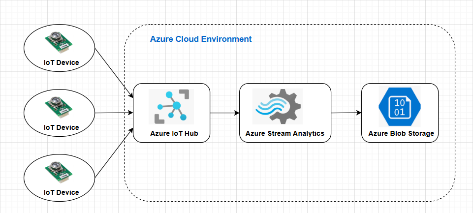

# 8916-group-assignment2
Group Member List
- Gao, Yue - 040895157
- Watson-Danis, Caleb - 041041241
- Wu, Qiaoqing - 041076817
## Scenario Description
### 1. Overview:
The Rideau Canal Skateway in Ottawa is the world’s largest outdoor ice skating rink, attracting many visitors during the winter. To keep skaters safe, it's important to constantly monitor the ice conditions. Things like temperature, ice thickness, and weather can change quickly, and these changes affect whether the ice is safe to skate on.

### 2. Problem Addressed by the Solution:
The problem is that it's difficult to continuously monitor the ice conditions along such a large area. If the ice gets too thin or the weather becomes dangerous, it can be unsafe for skaters. Without a system to track these changes in real time, accidents could happen.

### 3. The Solution Overview:
The solution is to build a real-time monitoring system that:
  - Simulates sensors to track ice and weather conditions along the canal.
  - IoT sensors pushing simulated data to Azure IoT Hub.
  - Proccess and analyzes the incoming data using Azure Stream Analytics to check if the conditions are safe or dangerous.
  - Stores the data in Azure Blob Storage for future analysis and reporting.

## System Architecture


## Implementation Details
### Part 1: IoT Sensor Simulation
#### 1. How the simulated IoT sensors generate and send data to Azure IoT Hub.
The simulated IoT sensors generate data using a script that mimics the real-world behavior of physical sensors. Each simulated sensor is associated with a specific location on the Rideau Canal (e.g., Dow's Lake, Fifth Avenue, NAC). The script generates random values for key data such as:
  - Ice Thickness (cm): Ranges from 20 to 50.
  - Surface Temperature (°C): Ranges from -5 to 5, formatted to one decimal place.
  - Snow Accumulation (cm): Ranges from 5 to 30.
  - External Temperature (°C): Ranges from -10 to 5, formatted to one decimal place.
  - Timestamp: The current date and time in ISO format.<br>

The script uses the Azure IoT SDK for Node.js to send messages to Azure IoT Hub. Here's a breakdown steps:
  - Connection Setup
    - The script authenticates with Azure IoT Hub using a device connection string, which is unique for each registered IoT device.
  - IoT Hub Client
    - A client object is created using the `azure-iot-device` and `azure-iot-device-mqtt` libraries, enabling secure communication with the IoT Hub.
  - Message Sending
    - The generated data is encapsulated in a `Message` object.
    - Each message is sent to Azure IoT Hub using the `sendEvent()` method.
    - The process is repeated at regular intervals, e.g., every 10 seconds.

#### 2. Structure of the JSON payload:
```json
{
  "location": "Dow's Lake",
  "iceThickness": 27,
  "surfaceTemperature": -1.4,
  "snowAccumulation": 8,
  "externalTemperature": -4.2,
  "timestamp": "2024-12-02T12:00:00Z"
}
```

#### 3. Scripts to simulate IoT sensors at three key locations on the Rideau Canal (e.g., Dow's Lake, Fifth Avenue, NAC):
```javascript
const { Client } = require('azure-iot-device');
const { Mqtt } = require('azure-iot-device-mqtt');
const { Message } = require('azure-iot-device');

const CONNECTION_STRING = "ConnectionStringHere";

// List of location to simulate
const LOCATIONS = ["Dow's Lake", "Fifth Avenue", "NAC"];

// Create an IoT Hub client
const client = Client.fromConnectionString(CONNECTION_STRING, Mqtt);

// Function to generate random sensor data
function generateSensorData(location) {
  return {
    location,
    iceThickness: Math.floor(Math.random() * (50 - 20 + 1) + 20), // random between 20-50cm
    surfaceTemperature: parseFloat((Math.random() * (5 - (-5)) + (-5)).toFixed(1)), // random between -5 to 5°C with 1 decimal place
    snowAccumulation: Math.floor(Math.random() * (30 - 5 + 1) + 5), // random between 5-30 cm
    externalTemperature: parseFloat((Math.random() * (5 - (-10)) + (-10)).toFixed(1)), // random between -10 to 5 °C with 1 decimal place
    timestamp: Date().toString() // local timestamp
  };
}

// Function to send sensor data for all locations
function sendSensorData() {
  LOCATIONS.forEach((location) => {
    const data = generateSensorData(location);
    const message = new Message(JSON.stringify(data)); // put message into JSON formate
    // show data in console log
    console.log(`Sending data: ${JSON.stringify(data)}`);
    client.sendEvent(message, (err) => {
      if (err) {
        console.error(`Failed to send data: ${err.toString()}`);
      } else {
        console.log(`Message sent for location: ${location}`);
      }
    });
  });
}

// Main function
async function main() {
  try {
    console.log("Connecting to IoT Hub ...");
    await client.open();
    console.log("Connected to IoT Hub. Starting simulation ...");
    
    // send data every 10 seconds (10000 milliseconds)
    setInterval(() => {
      sendSensorData();
    }, 10000);
  } catch (err) {
    console.error(`Error: ${err.toString()}`);
  }

  // disconnect and exit when receive signal
  process.on('SIGINT', async () => {
    console.log("Disconnecting from IoT Hub ...");
    await client.close();
    console.log("Disconnected. Exiting ...");
    process.exit();
  });
}

main();
```

### Part 2: Azure IoT Hub Configuration
#### 1. Create IoT Hub:
  - Go to the Azure Portal, search for **"IoT Hub"**, and click **Create**.
  - Fill in details like name, subscription (e.g., Azure for Students), resource group, and region (e.g., EAST US).
  - Choose the **Free Tier** for testing.
#### 2. Register Devices:
  - In the IoT Hub, go to **Devices** and click **Add Device**.
  - Provide a name for the device (e.g., Sensor1) and click **Save**.
  - Open the created device and copy the **Connection String** for later use in the simulation script.
#### 3. Set Up Endpoints:
  - Azure IoT Hub has a default endpoint called `messages/events`. This is where incoming device data is routed by default.
#### 4. Configure Message Routing:
  - In the IoT Hub settings, go to **Message Routing**.
  - Add a new route to direct messages to other Azure services, such as Azure Blob Storage or Stream Analytics.

### Part 3: Azure Stream Analytics Job
#### 1. Create a Stream Analytics Job:
  - In the Azure Portal, search for **"Stream Analytics Job"** and click **Create**.
  - Provide a name, subscription (e.g., Azure for Students), resource group, and region (e.g., EAST US).
#### 2. Input Source:
  - Go to **Input**, choose **Add input**->**IoT Hub** and select the IoT Hub you created earlier.
  - Use the default consumer group or create a new one.
#### 3. SQL query used for data processing:
```sql
SELECT
    IoTHub.ConnectionDeviceId AS DeviceId,
    ROUND(AVG(iceThickness), 1) AS AvgIceThickness,
    ROUND(AVG(surfaceTemperature), 1) AS AvgSurfaceTemp,
    System.Timestamp AS EventTime
INTO
    [BlobStorageOutput1001]
FROM
    [IoTHubInput1001]
GROUP BY
    IoTHub.ConnectionDeviceId, TumblingWindow(second, 60)
```
#### 4. Output Destination:
  - Go to "Outputs", and add an **Azure Blob Storage** output.
  - Select storage account and container.
  - Choose **JSON** as the output format.

### Part 4: Azure Blob Storage
#### 1. How the processed data is organized.
  - Processed data is stored in a folder structure:
  ```sql
  /processed-data/{deviceId}/{year}/{month}/{day}/
  ```
  - Example: `/processed-data/Sensor1/2024/12/02/ice-data.json`
  - Use descriptive names as file naming convention: `surface-temp-2024-12-02T00:00.json`
#### 2. Data Format:
  - Store data in **JSON** format for structure and readability:
  ```json
  {
    "DeviceId": "Sensor1",
    "AvgIceThickness": 28.5,
    "AvgSurfaceTemp": -1.3,
    "EventTime": "2024-12-02T12:00:00Z"
  }
  ```

## Usage Instructions
### Step 1: Running the IoT Sensor Simulation:
Step-by-step instructions for running the simulation script and Azure IoT Hub configuration
#### 1. Clone the Repository
```bash
git clone https://github.com/QiaoqingWu-AC/8916-group-assignment2.git
cd sensor-simulation
```
#### 2. Install Dependencies
```bash
npm install azure-iot-device azure-iot-device-mqtt
```                       
#### 3. Configure the Connection String
Replace `ConnectionStringHere` in script `simulate-sensor.js` with the **Device Connection String** copied from Azure IoT Hub.
```javascript
const CONNECTION_STRING = "ConnectionStringHere";
```
#### 4. Run the Script to start simulating data
The script will generate and send simulated sensor data to Azure IoT Hub every 10 seconds, and console logs indicating the data being sent.
```bash
node simulate-sensor.js
```

### Step 2: Configuring Azure Services
#### 1. Set Up IoT Hub
  - Open the Azure Portal, search for "IoT Hub," and create a new instance.
  - Register a device in the IoT Hub and copy its connection string.
#### 2. Create and Run Stream Analytics Job
  - Go to the Azure Portal, search for "**Stream Analytics Jobs**" and create a new job.
  - Add **IoT Hub** as the input source and configure the consumer group.
  - Open the **Query Editor** and used the provided query.
  - Add **Blob Storage** as the output destination.
  - Click **Start** to begin processing incoming data.

### Step 3: Accessing Stored Data
Follow these steps to locate and view the processed data in Azure Blob Storage:
#### 1. Open Azure Blob Storage
  - Navigate to the storage account in the Azure Portal.
  - Go to the **Containers** section and open the container used as the Stream Analytics
#### 2. Locate Processed Data
  - Browse the folder structure for `Sensor1` like: `/processed-data/Sensor1/2024/12/02/`.
#### 3. Download or View Files
  - Select a file (e.g., `ice-data-2024-11-23T00:00.json`) to download or view.
  - The files are stored in **JSON** format, which can be opened with a text editor or a JSON viewer.

## BELOW NEED TO BE COMPLETED
## Results
- Highlight key findings, such as: Aggregated data outputs (e.g. average ice thickness).
- Include references to sample output files stored in Blob Storage.

## Reflection
Discuss any challenges faced during implementation and how they were addressed.