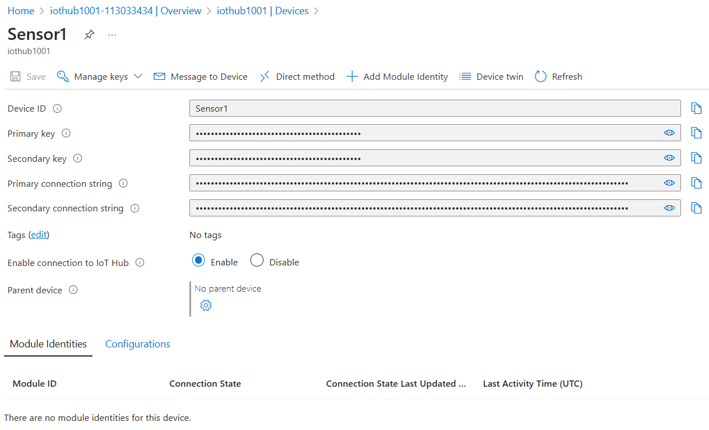

# 8916-group-assignment2
Group Member List
- Gao, Yue - 040895157
- Watson-Danis, Caleb - 041041241
- Wu, Qiaoqing - 041076817
## Scenario Description
1. **Overview:**
The Rideau Canal Skateway in Ottawa is the world’s largest outdoor ice skating rink, attracting many visitors during the winter. To keep skaters safe, it's important to constantly monitor the ice conditions. Things like temperature, ice thickness, and weather can change quickly, and these changes affect whether the ice is safe to skate on.

2. **Problem Addressed by the Solution:**
The problem is that it's difficult to continuously monitor the ice conditions along such a large area. If the ice gets too thin or the weather becomes dangerous, it can be unsafe for skaters. Without a system to track these changes in real time, accidents could happen.

3. **The Solution Overview**:
The solution is to build a real-time monitoring system that:
- Simulates sensors to track ice and weather conditions along the canal.
- IoT sensors pushing simulated data to Azure IoT Hub.
- Proccess and analyzes the incoming data using Azure Stream Analytics to check if the conditions are safe or dangerous.
- Stores the data in Azure Blob Storage for future analysis and reporting.

## System Architecture
 **Architecture diagram** illustrating the data flow:
- IoT sensors pushing simulated data to Azure IoT Hub.
- Azure Stream Analytics processing the incoming data.
- Processed data being stored in Azure Blob Storage.

## Implementation Details
- **IoT Sensor Simulation**:
  - Describe how the simulated IoT sensors generate and send data to Azure IoT Hub.
  - Structure of the JSON payload:
    ```json
    {
      "location": "Dow's Lake",
      "iceThickness": 27,
      "surfaceTemperature": -1,
      "snowAccumulation": 8,
      "externalTemperature": -4,
      "timestamp": "2024-11-23T12:00:00Z"
    }
    ```
    - scripts to simulate IoT sensors at three key locations on the Rideau Canal (e.g., Dow's Lake, Fifth Avenue, NAC):
    ```javascript
    const { Client } = require('azure-iot-device');
    const { Mqtt } = require('azure-iot-device-mqtt');
    const { Message } = require('azure-iot-device');

    const CONNECTION_STRING = "ConnectionStringHere";

    // List of location to simulate
    const LOCATIONS = ["Dow's Lake", "Fifth Avenue", "NAC"];

    // Create an IoT Hub client
    const client = Client.fromConnectionString(CONNECTION_STRING, Mqtt);

    // Function to generate random sensor data
    function generateSensorData(location) {
      return {
        location,
        iceThickness: Math.floor(Math.random() * (50 - 20 + 1) + 20), // random between 20-50cm
        surfaceTemperature: parseFloat((Math.random() * (5 - (-5)) + (-5)).toFixed(1)), // random between -5 to 5°C with 1 decimal place
        snowAccumulation: Math.floor(Math.random() * (30 - 5 + 1) + 5), // random between 5-30 cm
        externalTemperature: parseFloat((Math.random() * (5 - (-10)) + (-10)).toFixed(1)), // random between -10 to 5 °C with 1 decimal place
        timestamp: Date().toString() // local timestamp
      };
    }

    // Function to send sensor data for all locations
    function sendSensorData() {
      LOCATIONS.forEach((location) => {
        const data = generateSensorData(location);
        const message = new Message(JSON.stringify(data)); // put message into JSON formate
        // show data in console log
        console.log(`Sending data: ${JSON.stringify(data)}`);
        client.sendEvent(message, (err) => {
          if (err) {
            console.error(`Failed to send data: ${err.toString()}`);
          } else {
            console.log(`Message sent for location: ${location}`);
          }
        });
      });
    }

    // Main function
    async function main() {
      try {
        console.log("Connecting to IoT Hub ...");
        await client.open();
        console.log("Connected to IoT Hub. Starting simulation ...");
        
        // send data every 10 seconds (10000 milliseconds)
        setInterval(() => {
          sendSensorData();
        }, 10000);
      } catch (err) {
        console.error(`Error: ${err.toString()}`);
      }

      // disconnect and exit when receive signal
      process.on('SIGINT', async () => {
        console.log("Disconnecting from IoT Hub ...");
        await client.close();
        console.log("Disconnected. Exiting ...");
        process.exit();
      });
    }

    main();
    ```

- **Azure IoT Hub Configuration**:
  - Explain the configuration steps for setting up the IoT Hub, including endpoints and message routing.
- **Azure Stream Analytics Job**:
  - Describe the job configuration, including input sources, query logic, and output destinations.
  - Sample SQL queries used for data processing.
  ```sql
  SELECT
      IoTHub.ConnectionDeviceId AS DeviceId,
      AVG(iceThickness) AS AvgIceThickness,
      AVG(surfaceTemperature) AS AvgSurfaceTemp,
      System.Timestamp AS EventTime
  INTO
      [output1001]
  FROM
      [iothub1001]
  GROUP BY
      IoTHub.ConnectionDeviceId, TumblingWindow(second, 60)
  ```
- **Azure Blob Storage**:
  - Explain how the processed data is organized in Blob Storage (e.g., folder structure, file naming convention).
  - Specify the formats of stored data (JSON/CSV).
## Usage Instructions
- ### Running the IoT Sensor Simulation:
  - Step-by-step instructions for running the simulation script and Azure IoT Hub configuration
    1. Create an IoT Hub in Azure
    

    2. Register a Device                           
    

    3. Copy the connection string after creating the device
    
    
    4. Installing Required Libraries
        - Navigate to the project directory: 
        ```
        cd sensor-simulation
        ```
        - Execute the following commands:
        ```
        npm install azure-iot-device azure-iot-device-mqtt
        ```
    
    5. Replace connection string in script(simulate-sensors.js) w/ the connection string copied from device
      
    
    6. Run the script to start simulating sensor data
        - In sensor-simulation directory, run:
        ```
        node simulate-sensors.js
        ```
      
    
- **Configuring Azure Services**:
  - Describe how to set up and run the IoT Hub and Stream Analytics job.
- **Accessing Stored Data**:
  - Include steps to locate and view the processed data in Azure Blob Storage.
## Results
- Highlight key findings, such as: Aggregated data outputs (e.g. average ice thickness).
- Include references to sample output files stored in Blob Storage.
## Reflection
Discuss any challenges faced during implementation and how they were addressed.