# Screenshots of Azure IoT Hub, Stream Analytics, and Blob Storage
## Azure IoT Hub Configuration
### 1. Create an IoT Hub in Azure

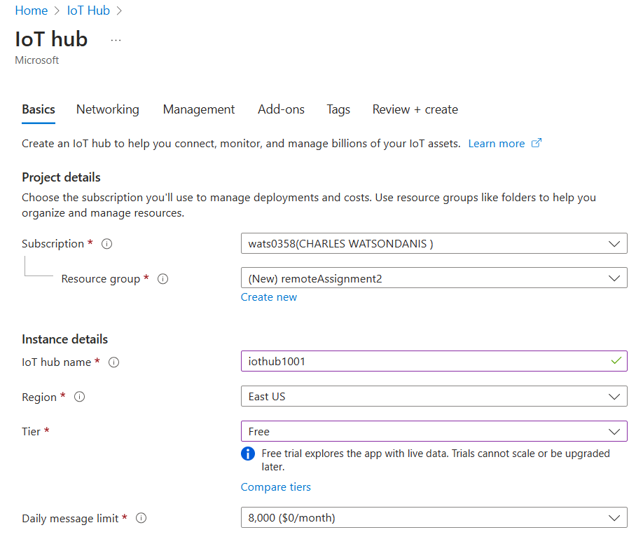

### 2. Add a device

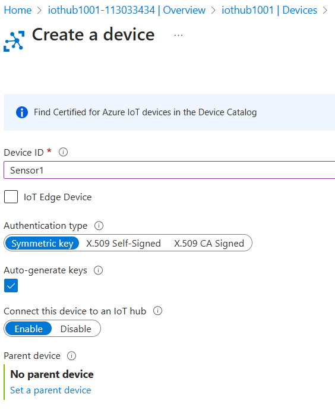

### 3. Copy the connection string after creating the device

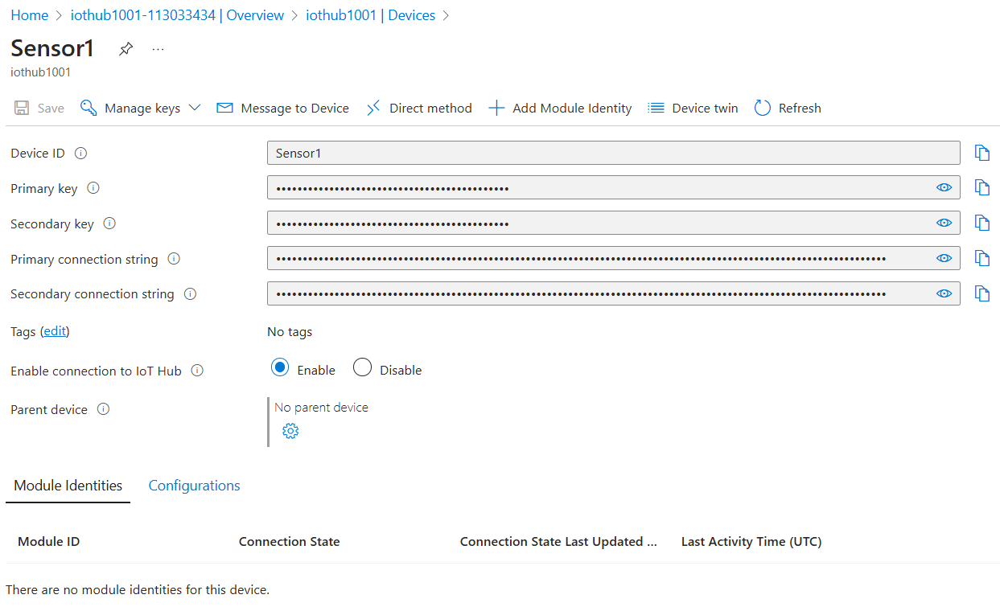

### 4. Replace connection string in script(simulate-sensors.js) w/ the connection string copied from device

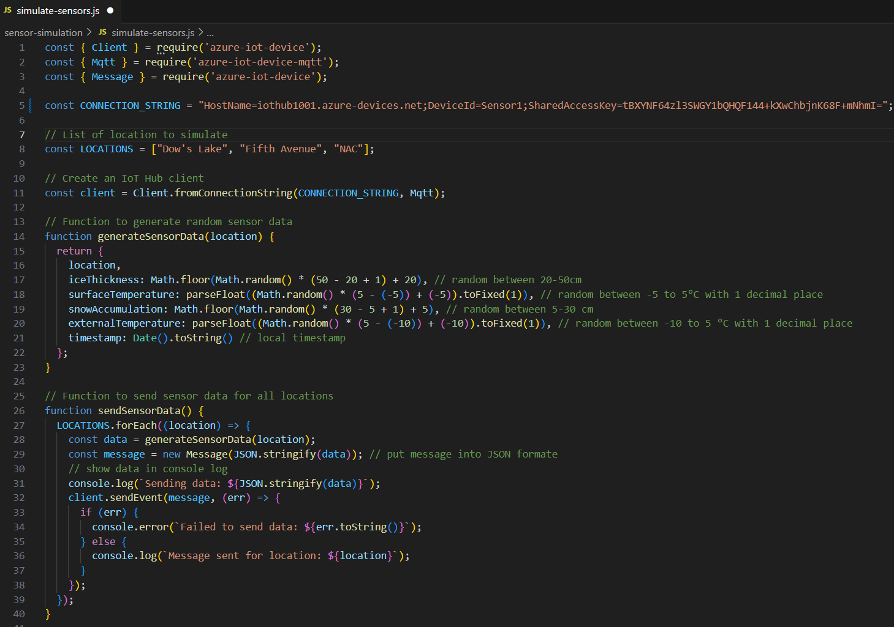

### 5. Run the script to start simulating sensor data

- In sensor-simulation directory, run:

**node simulate-sensors.js**

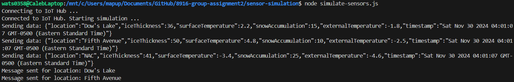

## Azure Stream Analytics job settings and queries
### 1. Create a Stream Analytics Job

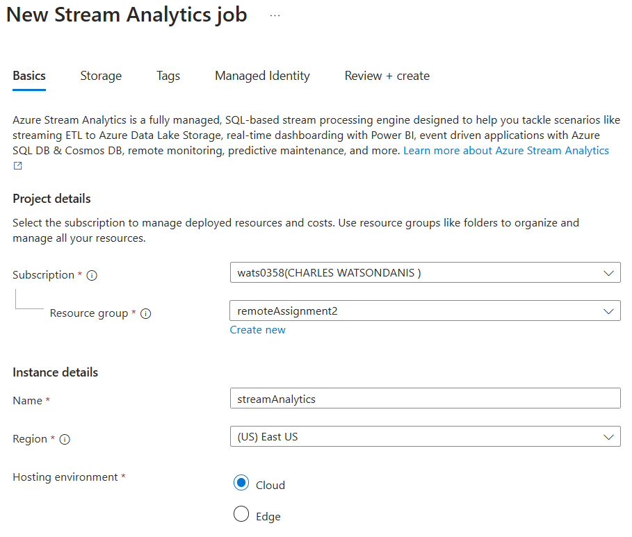

### 2. Add an input

- **Go to inputs section and add an input, take note of the config.**

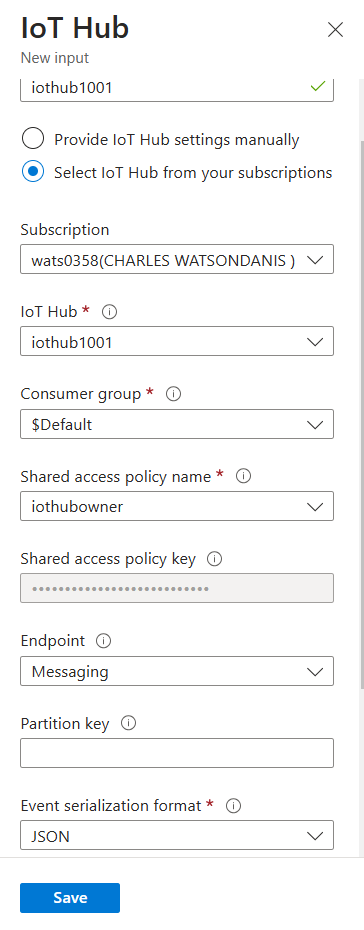

### 3. Add an output

- **Go to outputs section and add an output, take note of config.**
- **Choose the storage account you made.**
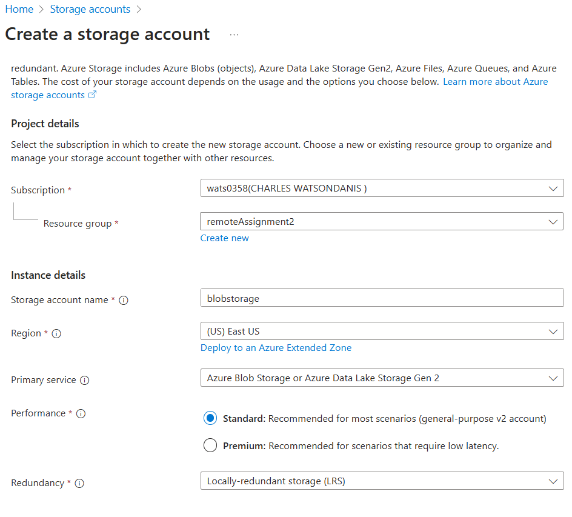
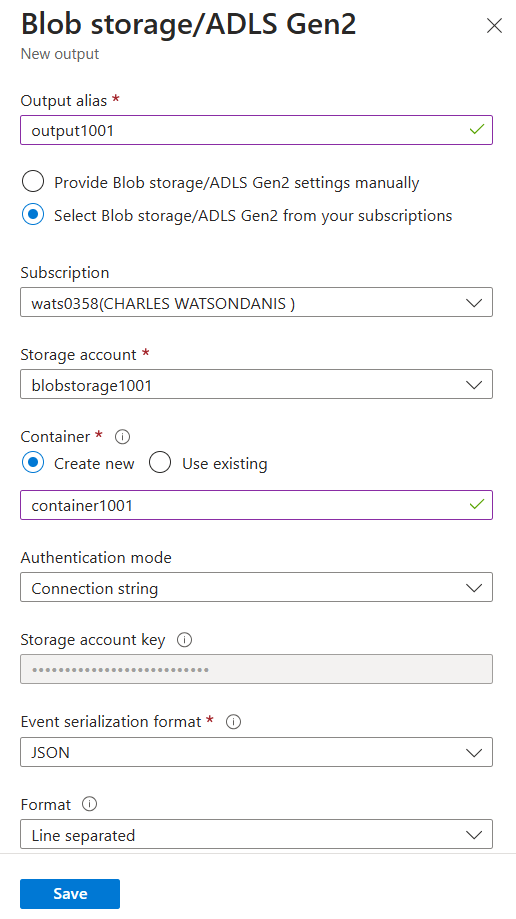

### 4. Make a query

- **Go to the query tab and replace the query with the following:**
```sql
SELECT
    IoTHub.ConnectionDeviceId AS DeviceId,
    ROUND(AVG(iceThickness), 1) AS AvgIceThickness,
    ROUND(AVG(surfaceTemperature), 1) AS AvgSurfaceTemp,
    System.Timestamp AS EventTime
INTO
    [output1001]
FROM
    [iothub1001]
GROUP BY
    IoTHub.ConnectionDeviceId, TumblingWindow(second, 60)
```

- **This query will calculate the average ice thickness & average surface temperature**

### 5. Test the query and Start the Job

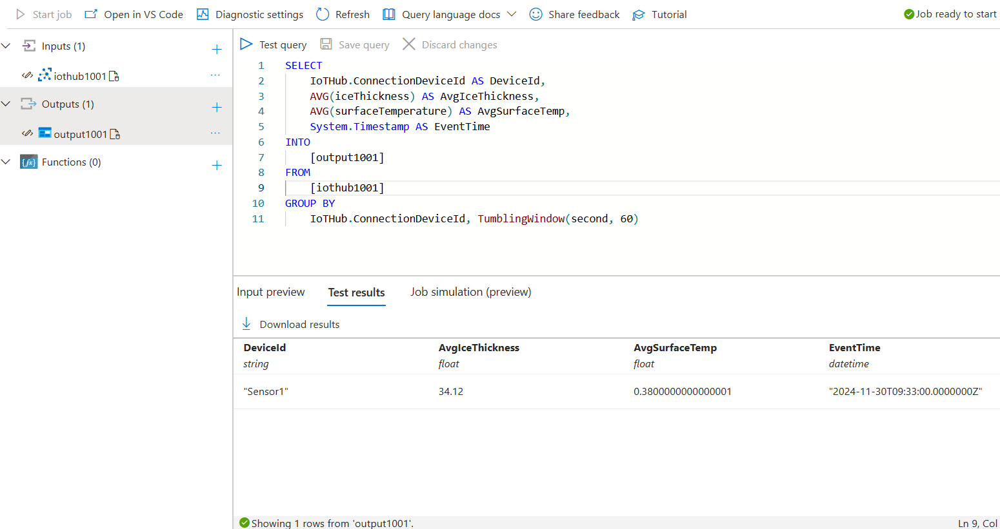

## Azure Blob Storage: Processed Data
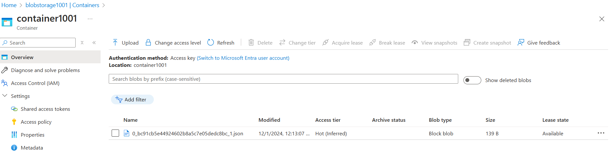
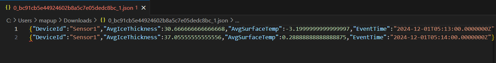