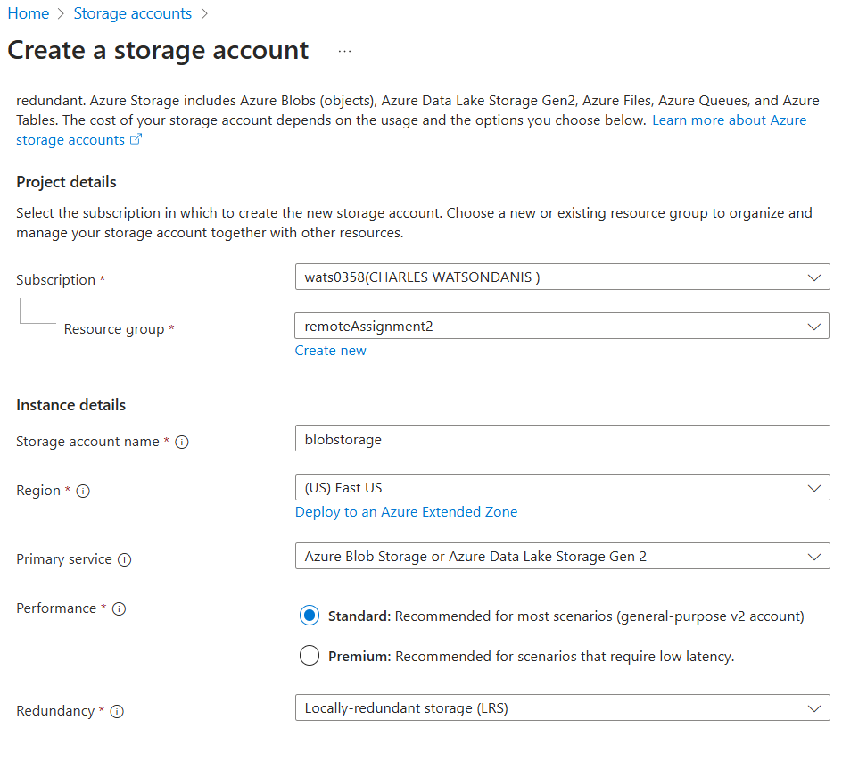

# Azure Blob Storage configuration & output in container

## 1. Make a storage account

- **Create a storage account with Azure Blob Storage as the primary service.**

## 2. Create a container

- **In storage account, go to container tab and create a new container.**

## 3. Complete steps in Azure-Stream-Analytics.md before proceeding

## 4. Verifying output in Blob Storage

- **Navigate to the container used for output.**

- If all is working, there should be processed data in .json format.