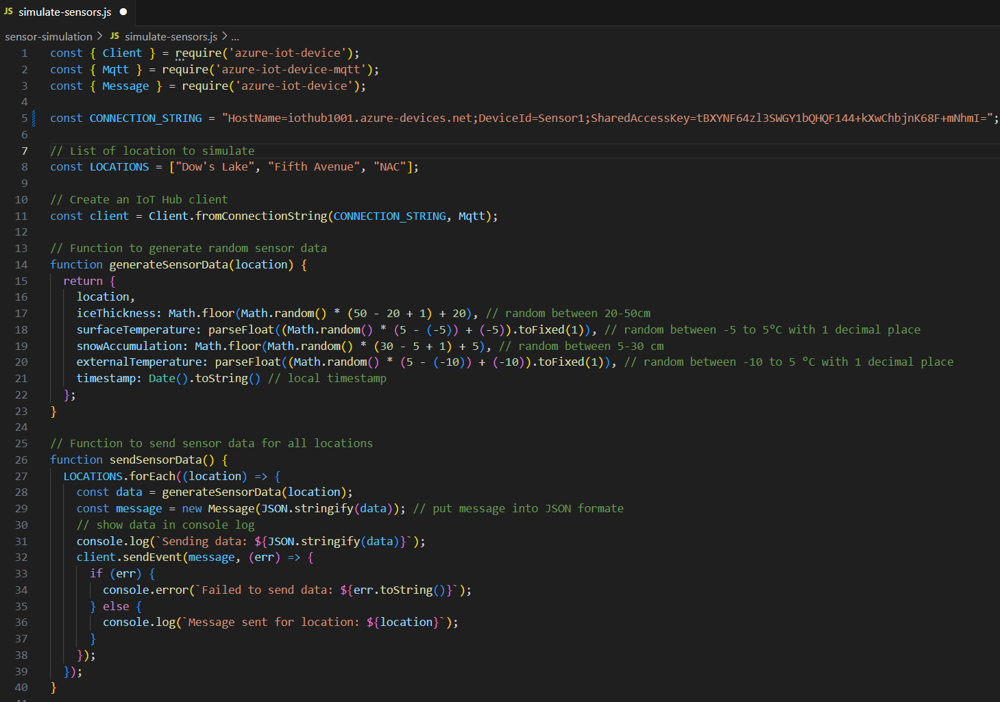

# Azure IoT Hub configuration screenshots

1. Create an IoT Hub in Azure

2. Add a device

3. Copy the connection string after creating the device

4. Installing libraries

Navigate to the project directory: 

cd sensor-simulation

Execute the following commands:

npm install azure-iot-device azure-iot-device-mqtt
pip install azure-iot-device

(I've found that sometimes pip install was not enough)

5. Replace connection string in script(simulate-sensors.js) w/ the connection string copied from device

6. Run the script to start simulating sensor data

In sensor-simulation directory, run:

node simulate-sensors.js

